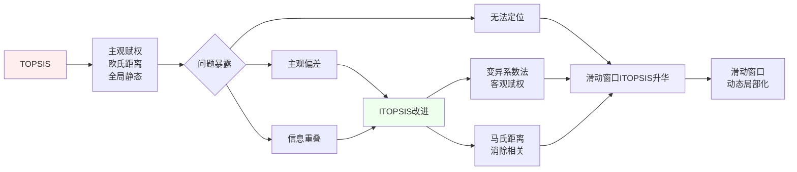

#STAN（海底地形辅助导航） #DRL #过拟合 #TOPSIS  #ITOPSIS #马氏距离 #指标协方差 #滑动窗口ITOPSIS
# 涉及论文1
## 标题
An efficient PSO-based AUV global path planning method incorporating with the positioning uncertainty-driven cost functions of both collision and terrain complexity
## 刊名
Ocean Engineering
## 作者
Peng Li , Nan Zang * , Jianhua Cheng , Runze Bai , Mohan Jin , Zifan Ma , Haochuan Dong
## 链接
https://linkinghub.elsevier.com/retrieve/pii/S0029801825014015

# STAN（海底地形辅助导航）
## 定义
通过**比对“实时探测到的海底地形”与“预先存储的数字地图”**，来修正航行器的位置误差。
水下导航主要依赖**惯性导航系统 (INS)**，但 INS 会随着时间推移产生积累误差（漂移）。STAN 的出现就是为了**消除这种积累误差**。
即通过感知器探测到的当前地形特征与预存的地形特征进行匹配后获取当前位置
### 类比
**“盲人摸象”般的定位**：
- 如果你闭着眼睛（没有 GPS）在自己家里走，你会根据走的步数估算位置（这是惯性导航）。
- 走了一会儿你可能会迷失方向，但当你摸到了一张熟悉的桌子或沙发的形状（探测地形），并将其与你脑海中的房间布局图（预存地图）对比，你就立刻知道自己确切在哪了。
## 推演
1. **推算位置**：INS 给出航行器当前的估计位置（存在误差）。
2. **实测地形**：航行器底部的声纳（如多波束测深仪）向海底发射声波，测量当前下方的水深和地形特征。
3. **检索地图**：系统在内部存储的**数字高程模型 (DEM)** 中，搜索 INS 估计位置附近的地形数据。
4. **匹配修正**：将“实测的地形轮廓”与“地图上的地形轮廓”进行匹配算法计算。一旦匹配成功，就能算出航行器的真实位置，从而重置 INS 的误差。
## 环境要求
- **地形丰富度 (Terrain Roughness)**：这是核心限制。如果海底是一片平坦的泥沙地，没有任何起伏特征，STAN 就无法工作（因为哪里测出来都一样）。**只有在地形起伏明显、特征丰富的区域，导航精度才高。**
- **地图精度**：必须预先拥有高精度的海底地图。如果预存地图本身是错的或者是低分辨率的，导航就会失败。
## 缺陷
### 缺陷内容
#### 定位精度不佳
普通的优化算法为了追求“路径最短”或“能耗最低”，往往会规划出一条直线。这条直线可能会穿过大片的平地
驶入平坦区域时，STAN 无法获得有效的地形特征（到处都一样深），导致**地图匹配失效，**此时，AUV 只能依靠惯性导航，误差开始快速积累**
最后选了一条“好走但容易迷路”的路。
#### 安全性低
安全性主要指避障。普通算法认为 AUV 是一个精确的点。
因为系统判定：只要距离障碍物 > 0 米即为安全。
由于存在**跟踪误差**，AUV 可能会向山脉方向偏离几米；由于存在**定位误差**，AUV 以为自己离危险地还有 10 米，但实际上可能已经只有 1 米了。
没有留出足够的**安全缓冲带，**微小的偏差就会导致 AUV 撞上障碍物。**
导致选了一条“容错率极低”的路。
#### 结论
在 STAN 路径规划中，不能只看“效率”（距离、能耗），必须把“不确定性”（位置并不准确、控制并不完美）纳入数学模型中。
### 改进
#### 重构约束条件 (Reconstructing Constraints)
- **碰撞约束重构**：不再假设潜艇是一个点，而是基于误差范围，把障碍物的危险区域“扩大”了（留出安全余量）。
- **地形约束重构**：不再只看地形是否起伏，而是结合误差看地形是否“在误差范围内依然好辨认”。
#### 衡量尺度重构
*为了让 STAN 导航更准，必须走“特征丰富”的路。*
作者构建了一个详细的地形模型，并发明了一把“新尺子”，叫做 **“地形唯一性指标”**。
这把尺子用来衡量某个区域的地形是否独一无二（越独特，越不容易匹配错）。这是通过一种改进的“多属性决策方法”算出来的。
#### PSO改进
**LSD-PSO**
1. **L (Latin Hypercube Sampling, 拉丁超立方采样)**：用于**初始化**。相比随机撒点，这种方法能让粒子分布得更均匀。
2. **S (Stratified Elite Opposition-based Learning, 分层精英反向学习)**：用于**跳出局部最优**。通过“反向思考”来增加搜索的多样性。
3. **D (Dynamic Self-adapting, 动态自适应)**：用于**参数调整**。让算法在搜索过程中自动调整参数，前期搜得广，后期搜得细。
# DRL的过拟合导致的环境复杂下的不适应
***深度学习模型*** *本身具有一定的* ***泛化能力*** *，可以在一定程度上应对环境的变化，* ***深度学习模型中的“环境复杂性引起的不适应性”并不是指模型完全无法响应变化***
## 原因
### 训练分布与测试分布不一致
- **强化学习是在线学习的**：智能体在训练过程中不断与环境交互，学习策略。
- 如果**环境动态发生变化**（比如物理参数、对手策略、地形结构变了），那么**原来训练出的策略可能就不再适用**。
- 虽然深度学习可以“泛化”，但**DRL的策略通常是对训练分布过拟合的**，一旦环境偏离训练分布，性能可能急剧下降。
### 环境复杂性 → 状态空间爆炸
- 复杂环境往往带来**高维、连续、部分可观察**的状态空间。
- DRL智能体依赖大量样本覆盖状态空间，但**复杂环境中状态空间增长极快**，导致**样本效率极低**。
- 结果就是：**智能体还没“见过”足够多的情况，环境就变了**，它自然无法适应。
### 策略脆弱性
- DRL学出的策略往往是 **“脆弱的最优”**，而不是 **“鲁棒的最优”**。
- 也就是说，它只在**非常窄的状态分布下表现好**，一旦环境有微小变化（比如噪声、延迟、视觉遮挡），策略就可能崩溃。
- 这与**深度学习在监督学习中的鲁棒性**不同，因为监督学习有**大量标注数据**来约束模型，而DRL只能靠**奖励信号**来“猜”什么是对的。
### 重新训练成本高

# 指标协方差
***协方差**（Covariance）是衡量**两个指标之间"联动变化"程度的统计量**。在ITOPSIS中，它揭示了不同评价指标是否"一荣俱荣、一损俱损"。*
即先找出某些指标之间的关系，避免决策被重复信息误导
## 定义
指标A和指标B是否**一起变大或变小**
本质为共同变化的方差
## 出现原因
* 部分指标**正相关**，信息**重复多**，用欧氏距离会"重复计算"优势
* 部分指标**负相关**，存在**权衡关系**，需要更谨慎地平衡矛盾指标
## 公式
$\text{Cov}(X,Y) = \frac{\sum\left[(X_i - \bar{X}) \times (Y_i - \bar{Y})\right]}{n-1}$

$(X_i - \bar{X})$ ：方案i在指标X上的**偏离程度**
$(Y_i - \bar{Y})$  ：方案i在指标Y上的**偏离程度**
**乘积**：两个偏离程度是 **同向** 还是 **反向**
**求平均**：所有方案的联动程度
## 作用
* **自动消除量纲**:协方差计算本身包含单位，Σ⁻¹会**自动标准化**，无需人工归一化a和b的量纲差异。
* **识别隐藏冲突**
* **马氏距离**通过Σ⁻¹把重复信息"压缩"1次，避免信息冗余
## 结果及应对
| 概念        | 阐释         | 作用        |
| --------- | ---------- | --------- |
| **正协方差**  | 一荣俱荣（重复信息） | 需要压缩权重    |
| **负协方差**  | 此消彼长（权衡关系） | 需要放大矛盾    |
| **协方差矩阵** | 所有指标联动关系表  | 马氏距离的计算原料 |
# 马氏距离
距离不应该只看"直线远近"，还要看**数据朝哪个方向分布**。
## 核心
*它先问："这两个指标相关性有多强？"，然后**消除相关性**的影响，给出"真实"距离。*
### 步骤
1. 计算获得协方差矩阵
2. 求解协方差矩阵的逆矩阵以消除相关性
3. $d_M(\mathbf{x}, \mathbf{y}) = \sqrt{(\mathbf{x} - \mathbf{y})^T \Sigma^{-1} (\mathbf{x} - \mathbf{y})}$
- **(x-y)**：点到均值的向量
- **Σ⁻¹**："反向缩放"操作（消除相关性和量纲）
- **ᵀ**：转置（矩阵运算需要）
# TOPSIS
## 原理
TOPSIS（理想解相似性排序法）是一种多目标决策分析方法。其核心步骤如下：
1. **数据归一化**：消除量纲影响，构建规范化矩阵。  
2. **确定理想解与反理想解**：分别找出各指标的最优值和最劣值。  
3. **计算距离**：评估每个方案与理想解和反理想解的距离。  
4. **计算贴近度**：通过距离得出各方案与理想解的相对接近程度，取值范围为0～1。  
5. **排序优选**：贴近度越接近1，方案越优；越接近0，方案越劣。
该方法通过量化各方案与“最优”和“最劣”目标的相对距离，实现科学排序与优选。
## 步骤
1. **原始矩阵正向化**：统一转化为极大型指标
	![[file-20251125220911184.png]]
2. **正向标准化**
	*消除不同指标量纲的影响*
	![[file-20251125221152188.png]]
3. 计算得分并归一化
	$S_{i}=\frac{D_{i}^{-}}{D_{i}^{+}+D_{i}^{-}}$ 其中$S_{i}$为得分，$D_{i}^{+}$为评价对象与最大值的距离，$D_{i}^{-}$为评价对象与最小值的距离，值越大方案越优
# ITOPSIS
## 核心改进
### 客观赋权
- 通过**变异系数Vⱼ = σⱼ/μⱼ**自动计算权重
	传统TOPSIS权重常由专家经验确定，主观性强，而**CV变异系数**或**熵权法**，根据数据离散程度客观计算，减少人为偏差
### 马氏距离替代欧氏距离
- 使用**马氏距离（Mahalanobis Distance）**：D² = (x-μ)ᵀ Σ⁻¹ (x-μ)
	考虑指标协方差
## 滑动窗口ITOPSIS
### 相关改进
**窗口局部化**
* 每个独立窗口各自进行独立执行ITOPSIS
	独立赋权 与 独立马氏距离
**动态更新**
* 新数据进入时滑出旧数据
**全局最优**
*最后的结果并非简单拼接*
窗口结果采用以下方式进行拼接
1. **平滑处理**：用移动平均消除窗口边界突变
2. **一致性检验**：两个窗口的评估要逻辑连贯
3. **热点识别**：部分数据极端的窗口进行标记
### 结果
可以获得一个完善的全局性的信息，物体在行驶过程中可以提前预知前方情况

