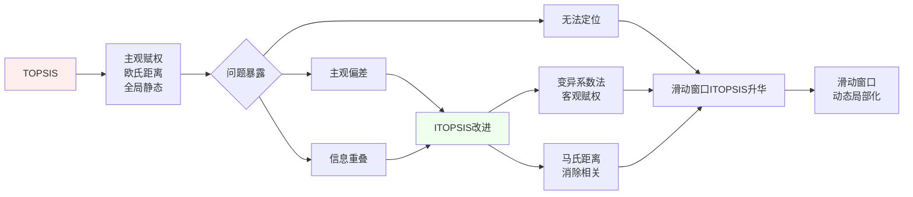

#STAN（海底地形辅助导航） #DRL #过拟合 #TOPSIS  #ITOPSIS #马氏距离 #指标协方差 #滑动窗口ITOPSIS #SDEM构建 #卡尔曼滤波 #高斯白噪声 #蒙特卡洛采样 #LHS（拉丁超立方采样） #SPSO 
# 涉及论文1
## 标题
An efficient PSO-based AUV global path planning method incorporating with the positioning uncertainty-driven cost functions of both collision and terrain complexity
## 刊名
Ocean Engineering
## 作者
Peng Li , Nan Zang * , Jianhua Cheng , Runze Bai , Mohan Jin , Zifan Ma , Haochuan Dong
## 链接
https://linkinghub.elsevier.com/retrieve/pii/S0029801825014015

# STAN（海底地形辅助导航）
## 定义
通过**比对“实时探测到的海底地形”与“预先存储的数字地图”**，来修正航行器的位置误差。
水下导航主要依赖**惯性导航系统 (INS)**，但 INS 会随着时间推移产生积累误差（漂移）。STAN 的出现就是为了**消除这种积累误差**。
即通过感知器探测到的当前地形特征与预存的地形特征进行匹配后获取当前位置
### 类比
**“盲人摸象”般的定位**：
- 如果你闭着眼睛（没有 GPS）在自己家里走，你会根据走的步数估算位置（这是惯性导航）。
- 走了一会儿你可能会迷失方向，但当你摸到了一张熟悉的桌子或沙发的形状（探测地形），并将其与你脑海中的房间布局图（预存地图）对比，你就立刻知道自己确切在哪了。
## 推演
1. **推算位置**：INS 给出航行器当前的估计位置（存在误差）。
2. **实测地形**：航行器底部的声纳（如多波束测深仪）向海底发射声波，测量当前下方的水深和地形特征。
3. **检索地图**：系统在内部存储的**数字高程模型 (DEM)** 中，搜索 INS 估计位置附近的地形数据。
4. **匹配修正**：将“实测的地形轮廓”与“地图上的地形轮廓”进行匹配算法计算。一旦匹配成功，就能算出航行器的真实位置，从而重置 INS 的误差。
## 环境要求
- **地形丰富度 (Terrain Roughness)**：这是核心限制。如果海底是一片平坦的泥沙地，没有任何起伏特征，STAN 就无法工作（因为哪里测出来都一样）。**只有在地形起伏明显、特征丰富的区域，导航精度才高。**
- **地图精度**：必须预先拥有高精度的海底地图。如果预存地图本身是错的或者是低分辨率的，导航就会失败。
## 缺陷
### 缺陷内容
#### 定位精度不佳
普通的优化算法为了追求“路径最短”或“能耗最低”，往往会规划出一条直线。这条直线可能会穿过大片的平地
驶入平坦区域时，STAN 无法获得有效的地形特征（到处都一样深），导致**地图匹配失效，**此时，AUV 只能依靠惯性导航，误差开始快速积累**
最后选了一条“好走但容易迷路”的路。
#### 安全性低
安全性主要指避障。普通算法认为 AUV 是一个精确的点。
因为系统判定：只要距离障碍物 > 0 米即为安全。
由于存在**跟踪误差**，AUV 可能会向山脉方向偏离几米；由于存在**定位误差**，AUV 以为自己离危险地还有 10 米，但实际上可能已经只有 1 米了。
没有留出足够的**安全缓冲带，**微小的偏差就会导致 AUV 撞上障碍物。**
导致选了一条“容错率极低”的路。
#### 结论
在 STAN 路径规划中，不能只看“效率”（距离、能耗），必须把“不确定性”（位置并不准确、控制并不完美）纳入数学模型中。
### 改进
#### 重构约束条件 (Reconstructing Constraints)
- **碰撞约束重构**：不再假设潜艇是一个点，而是基于误差范围，把障碍物的危险区域“扩大”了（留出安全余量）。
- **地形约束重构**：不再只看地形是否起伏，而是结合误差看地形是否“在误差范围内依然好辨认”。
#### 衡量尺度重构
*为了让 STAN 导航更准，必须走“特征丰富”的路。*
作者构建了一个详细的地形模型，并发明了一把“新尺子”，叫做 **“地形唯一性指标”**。
这把尺子用来衡量某个区域的地形是否独一无二（越独特，越不容易匹配错）。这是通过一种改进的“多属性决策方法”算出来的。
#### PSO改进
**LSD-PSO**
1. **L (Latin Hypercube Sampling, 拉丁超立方采样)**：用于**初始化**。相比随机撒点，这种方法能让粒子分布得更均匀。
2. **S (Stratified Elite Opposition-based Learning, 分层精英反向学习)**：用于**跳出局部最优**。通过“反向思考”来增加搜索的多样性。
3. **D (Dynamic Self-adapting, 动态自适应)**：用于**参数调整**。让算法在搜索过程中自动调整参数，前期搜得广，后期搜得细。
# DRL的过拟合导致的环境复杂下的不适应
***深度学习模型*** *本身具有一定的* ***泛化能力*** *，可以在一定程度上应对环境的变化，* ***深度学习模型中的“环境复杂性引起的不适应性”并不是指模型完全无法响应变化***
## 原因
### 训练分布与测试分布不一致
- **强化学习是在线学习的**：智能体在训练过程中不断与环境交互，学习策略。
- 如果**环境动态发生变化**（比如物理参数、对手策略、地形结构变了），那么**原来训练出的策略可能就不再适用**。
- 虽然深度学习可以“泛化”，但**DRL的策略通常是对训练分布过拟合的**，一旦环境偏离训练分布，性能可能急剧下降。
### 环境复杂性 → 状态空间爆炸
- 复杂环境往往带来**高维、连续、部分可观察**的状态空间。
- DRL智能体依赖大量样本覆盖状态空间，但**复杂环境中状态空间增长极快**，导致**样本效率极低**。
- 结果就是：**智能体还没“见过”足够多的情况，环境就变了**，它自然无法适应。
### 策略脆弱性
- DRL学出的策略往往是 **“脆弱的最优”**，而不是 **“鲁棒的最优”**。
- 也就是说，它只在**非常窄的状态分布下表现好**，一旦环境有微小变化（比如噪声、延迟、视觉遮挡），策略就可能崩溃。
- 这与**深度学习在监督学习中的鲁棒性**不同，因为监督学习有**大量标注数据**来约束模型，而DRL只能靠**奖励信号**来“猜”什么是对的。
### 重新训练成本高

# 指标协方差
***协方差**（Covariance）是衡量**两个指标之间"联动变化"程度的统计量**。在ITOPSIS中，它揭示了不同评价指标是否"一荣俱荣、一损俱损"。*
即先找出某些指标之间的关系，避免决策被重复信息误导
## 定义
指标A和指标B是否**一起变大或变小**
本质为共同变化的方差
## 出现原因
* 部分指标**正相关**，信息**重复多**，用欧氏距离会"重复计算"优势
* 部分指标**负相关**，存在**权衡关系**，需要更谨慎地平衡矛盾指标
## 公式
$\text{Cov}(X,Y) = \frac{\sum\left[(X_i - \bar{X}) \times (Y_i - \bar{Y})\right]}{n-1}$

$(X_i - \bar{X})$ ：方案i在指标X上的**偏离程度**
$(Y_i - \bar{Y})$  ：方案i在指标Y上的**偏离程度**
**乘积**：两个偏离程度是 **同向** 还是 **反向**
**求平均**：所有方案的联动程度
## 作用
* **自动消除量纲**:协方差计算本身包含单位，Σ⁻¹会**自动标准化**，无需人工归一化a和b的量纲差异。
* **识别隐藏冲突**
* **马氏距离**通过Σ⁻¹把重复信息"压缩"1次，避免信息冗余
## 结果及应对
| 概念        | 阐释         | 作用        |
| --------- | ---------- | --------- |
| **正协方差**  | 一荣俱荣（重复信息） | 需要压缩权重    |
| **负协方差**  | 此消彼长（权衡关系） | 需要放大矛盾    |
| **协方差矩阵** | 所有指标联动关系表  | 马氏距离的计算原料 |
# 马氏距离
距离不应该只看"直线远近"，还要看**数据朝哪个方向分布**。
## 核心
*它先问："这两个指标相关性有多强？"，然后**消除相关性**的影响，给出"真实"距离。*
### 步骤
1. 计算获得协方差矩阵
2. 求解协方差矩阵的逆矩阵以消除相关性
3. $d_M(\mathbf{x}, \mathbf{y}) = \sqrt{(\mathbf{x} - \mathbf{y})^T \Sigma^{-1} (\mathbf{x} - \mathbf{y})}$
- **(x-y)**：点到均值的向量
- **Σ⁻¹**："反向缩放"操作（消除相关性和量纲）
- **ᵀ**：转置（矩阵运算需要）
# TOPSIS
## 原理
TOPSIS（理想解相似性排序法）是一种多目标决策分析方法。其核心步骤如下：
1. **数据归一化**：消除量纲影响，构建规范化矩阵。  
2. **确定理想解与反理想解**：分别找出各指标的最优值和最劣值。  
3. **计算距离**：评估每个方案与理想解和反理想解的距离。  
4. **计算贴近度**：通过距离得出各方案与理想解的相对接近程度，取值范围为0～1。  
5. **排序优选**：贴近度越接近1，方案越优；越接近0，方案越劣。
该方法通过量化各方案与“最优”和“最劣”目标的相对距离，实现科学排序与优选。
## 步骤
1. **原始矩阵正向化**：统一转化为极大型指标
	![[file-20251125220911184.png]]
2. **正向标准化**
	*消除不同指标量纲的影响*
	![[file-20251125221152188.png]]
3. 计算得分并归一化
	$S_{i}=\frac{D_{i}^{-}}{D_{i}^{+}+D_{i}^{-}}$ 其中$S_{i}$为得分，$D_{i}^{+}$为评价对象与最大值的距离，$D_{i}^{-}$为评价对象与最小值的距离，值越大方案越优
# ITOPSIS
## 核心改进
### 客观赋权
- 通过**变异系数Vⱼ = σⱼ/μⱼ**自动计算权重
	传统TOPSIS权重常由专家经验确定，主观性强，而**CV变异系数**或**熵权法**，根据数据离散程度客观计算，减少人为偏差
### 马氏距离替代欧氏距离
- 使用**马氏距离（Mahalanobis Distance）**：D² = (x-μ)ᵀ Σ⁻¹ (x-μ)
	考虑指标协方差
## 滑动窗口ITOPSIS
### 采用原因
标准TOPSIS方法中，**理想解（G_best）和非理想解（G_worst）是固定的全局常量**
这会导致部分地区其本身具有相对不错的特性，但是在全局中会被判定为较差区域
### 相关改进
**窗口局部化**
* 每个独立窗口各自进行独立执行ITOPSIS
	独立赋权 与 独立马氏距离
**动态更新**
* 新数据进入时滑出旧数据
**全局最优**
*最后的结果并非简单拼接*
窗口结果采用以下方式进行拼接
1. **平滑处理**：用移动平均消除窗口边界突变
2. **一致性检验**：两个窗口的评估要逻辑连贯
3. **热点识别**：部分数据极端的窗口进行标记
### 结果
可以获得一个完善的全局性的信息，物体在行驶过程中可以提前预知前方情况

```mermaid
graph LR
    A[TOPSIS] --> B[主观赋权<br/>欧氏距离<br/>全局静态];
    B --> C{问题暴露};
    C --> D[主观偏差];
    C --> E[信息重叠];
    C --> F[无法定位];
    
    D --> G[ITOPSIS改进];
    E --> G;
    G --> H[变异系数法<br/>客观赋权];
    G --> I[马氏距离<br/>消除相关];
    
    F --> J[滑动窗口ITOPSIS升华];
    H --> J;
    I --> J;
    J --> K[滑动窗口<br/>动态局部化];
    
    style A fill:#fee;
    style G fill:#efe;
    style J fill:#eef;
```
# 改进PSO算法以完成任务序列规划
### PSO算法概述
PSO算法借助现实的鸟群作为投射例子，其关键状态量为**运动矢量和空间坐标** *（速度和位置）*
运动矢量决定了粒子在解空间中的探索方向与步长,而空间坐标则对应优化问题的一个可行解
其算法流程为进行种群初始化,随机设定各粒子的初始位置和速度向量;随后进入迭代优化循环，该循环持续进行直至满足终止条件,最终输出全局最优解
## PSO算法不足改进
传统PSO的学习因子和惯性权重通常设置为固定值，前者限制了算法在不同阶段的灵活性，后者将导致算法过早的收敛成为最优解
且在迭代过程中会出现鸟因某次失误而被抛弃，从而丢失潜在的最优解，造成历史最优解的缺失
### **惯性权重**
传统惯性权重为固定值，此文对惯性权重W作了线性递减，早期W可覆盖整个搜索空间，一直精细搜索直到最后集中在历史最佳区域做局部搜索
针对初始惯性权重,取较大值时可显著增强粒子群体的全局探索能力,避免在早期陷入局部极值。针对最终惯性权重,取较小的值时有助于加强局部寻优的精度,提升算法在收敛阶段的稳定性
### **学习因子**
不同于惯性权重采用线性递减，学习因子采用指数曲线；指数曲线有利在早期仍保持较好的自我速度，前期几乎不变，后期骤变，构造出一种类似惯性的性质，使其能够在前期更多的依照自我而非大群进行搜索
### **精英粒子保留**
针对前面提到的潜在最优丢失现象，此文对这些历史出现过的最优解进行保留，防止因某次差解而丢失优解；且在保留之后对最差因子进行写入，提高总体水平
> 基准测试

此文采用*多峰函数 Rastrigin Function 及高维复杂函数 Griewank Function*对改进后的PSO算法进行测试，两个函数彼此弥补各自所确实的复杂性，保证了改进后的PSO能够处于与现实相近的任务环境当中

# 改进RRT算法完成局部路径更优规划
## RRT算法改进
引入最优父节点重选择和树结构重布置，具体表现为空间拓扑化、概率采样和节点拓展相结合以及增量式优化
## 最优父节点和树结构重布置
相较于传统RRT，RRT*在新节点生成之后还将进行半径范围内的搜寻，寻找更近的节点，在搜寻成功后进行挂新，将父节点更新到最新的父节点，以此做到每次迭代时都能够多一次搜寻优化

树结构的重布置让算法集中于当前的树结构，且只进行采样点的维护与构造，并不对树之外的空白空间进行资源付出，以此达到资源的节省优化
## 概率采样和节点拓展相结合
按照经验和已有概率进行节点生成，并引入碰撞检测，节点与节点之间只在局部无碰撞时才执行挂父节点，于是树单向生长，做到资源集中利用

**减少无效采样**
防止因节点数增多而多次锚定住无用区域，此处涉及*障碍物感知*  *目标偏置*  以及 *人工势场感知*
**目标偏置**
在每次迭代中，目标方向的选择将保持在每轮固定小概率（典型 5%~15%）直接把方向扔向目标点 q_goal；其余 85%~95% 仍是纯随机，确保探索。
针对此方法，论文采用以下公式实现：
$p_{\mathrm{bias}}=p_{\mathrm{base}}+\alpha\left(1-\frac{D(q_{\mathrm{near}})}{D_{\mathrm{max}}}\right)$
p_bias起到确定是否要瞄准目标点的作用，障碍物越稀疏，p_bias 越大，机器人越向目标方向进行瞄准
**人工势场**
目标点是磁铁，礁石是斥力点；AUV将被吸向目标点，被斥力点推开。
能量代价的引入，原来只测量“公里数”；现在再加爬高磁场=高代价资源，促进规划更为低消耗资源的路线
高代价资源在此名为势能代价值 Cenergy(q)，具体公式参与：
$C_\mathrm{energy}(q_i,q_j)=||q_i-q_j||+\lambda\cdot\int_{q_i}^{q_j}||\nabla U(q)||dl$
# SDEM
## 构建
借助三角函数和指数函数叠加
### 三角函数
频率控制山峰密集程度，振幅控制高度
### 指数函数
构建缓坡和衰减特征
### 结合
采用 **"最大值叠加"** 策略来构建最终地形高度场
$Hter(X) = max (Hbasic(X), Hmou(X))$
**Hter(X)**：位置 **X** 处的**最终地形高度**（Terrain Height）
**Hbasic(X)**：**基础地形高度**函数（可能代表平缓的海床或背景地形）
**Hmou(X)**：**水下山峰/山地高度**函数（Mount Underwater）
**max()**：逐点取最大值操作
* 此处定义了**高度基准面**：**海床 = 0 米**（参考基准面）且**高度值向上为正**（朝向水面方向）

# 滑动窗口要点
其公式为：
$D_i^{\text{best}} = \sqrt{\sum_{j=1}^{n_{\text{ind}}} \varphi_j \left(G_j^{\text{best}} - z_{ij}\right)^2}$
$D_i^{\text{worst}} = \sqrt{\sum_{j=1}^{n_{\text{ind}}} \varphi_j \left(G_j^{\text{worst}} - z_{ij}\right)^2}$
$S_i = D_i^{\text{worst}} \, / \, \left(D_i^{\text{best}} + D_i^{\text{worst}}\right)$
## Gbest与Gworst的全局唯一性
虽然采用了**滑动窗口**技术，但Gbest和Gworst是**全局唯一**的，而不是每个窗口各有一组
### 原因
滑动窗口的作用是**采样和计算**，而非定义局部标准。所有窗口的复杂度评估都回归到**同一对全局标杆**
所有窗口用同一标准打分，S_i才有跨区域的比较意义
### 做法
如果我们对每个窗口都计算一次全局理想解 Gbest​ 和全局非理想解 Gworst​ ，那么这些解就会随着窗口的变化而变化，从而变得不唯一且不固定。
因此我们采取以下方法
#### 步骤一 全局计算 Gbest​ 和 Gworst​
1. **初始化**：在开始滑动窗口计算之前，首先对整个SDEM进行一次全局扫描，计算所有地形复杂度指标的全局最大值和最小值。
2. **计算**：对于每个地形复杂度指标 j ，找到整个SDEM上的最大值和最小值：
	 $Gbestj=max(z1j​,z2j​,...,zNj​)$
	 $Gworstj​=min(z1j​,z2j​,...,zNj​)$
3. **结果**：得到每个指标的全局理想解向量 Gbest​ 和全局非理想解向量 Gworst​
#### 步骤 2 滑动窗口计算
1. **滑动窗口**：在SDEM上应用滑动窗口技术，计算每个窗口内的地形复杂度指标。
2. **量化结果**：对于每个窗口 i ，得到第 j 个地形复杂度指标的量化结果 zij​ 。
#### 步骤 3 熵权法计算
使用熵权法计算每个地形复杂度指标的权重 φj​ 。
>**完成上述步骤操作后** 依照论文提供的公式计算后得出每个窗口的**地形复杂度得分**
  得分可用于后续的路径规划等系统
# 航向角与偏航率
## 航向角
**定义：** AUV 当前时刻在地图上的绝对朝向（与X轴的夹角）。
**状态量**  直接决定了AUV下一秒将往哪个方向前进
## 偏航率
**定义：** 航向角随时间的变化率（角速度）。
**控制量** 代表 AUV 转弯的快慢。
## 平滑约束 (3.4)
论文明确指出AUV是**欠驱动系统 (Underactuated System)**，这意味着它受到物理限制，不能直接原地旋转。
于是论文构建了 **路径平滑度代价函数**，通过限制相邻路径段的夹角，限制偏航率的最大值
# 卡尔曼滤波
核心是利用**系统动力学模型**（先验知识）和**传感器观测值**（似然概率），在假设噪声服从高斯分布的前提下，计算出系统状态的**后验概率分布**。
## 相关定义
### 噪声矩阵
**过程噪声协方差矩阵**  描述系统模型的不确定性。
**测量噪声协方差矩阵**  描述观测传感器的不确定性。
### 相关公式
$\begin{align*} \hat{x}_k &= \frac{1}{k}(z_1 + z_2 + \dots + z_k) \\ &= \frac{1}{k}(z_1 + z_2 + \dots + z_{k-1}) + \frac{1}{k} z_k \\ &= \frac{k-1}{k} \hat{x}_{k-1} + \frac{1}{k} z_k \\ &= \left(1 - \frac{1}{k}\right) \hat{x}_{k-1} + \frac{1}{k} z_k \\ &= \hat{x}_{k-1} + \frac{1}{k}\left(z_k - \hat{x}_{k-1}\right) \end{align*}$
### 步骤
1. 利用状态转移矩阵，将上一时刻的最佳估计推演到当前时刻。
2. 将上一时刻的误差协方差传播到当前时刻，并叠加过程噪声
	每过一秒，你对位置的**不确定性（那个黄色的误差椭圆）** 就会变大一点。这个“变大”的来源就是过程噪声
3. **计算卡尔曼增益**
	 $K_k = P_k H^T \left( H P_k H^T + R \right)^{-1}$
	K是修正权重矩阵。它衡量了预测误差协方差 P与测量噪声 R的相对比例。
4. 不同时刻下根据K值决定最后状态如何更新
	**状态更新：** $\hat{x}_k = \hat{x}_k^- + K_k \left( z_k - H \hat{x}_k^- \right)$
	**协方差更新：** $P_k = (I - K_k H) P_{k}^-$
	*那个原本变大的黄色椭圆，因为有了新的观测数据佐证，被**压缩**变小了*
### 结果
算法模拟：“如果走这条路，会有危险性，但我能看到地形进行修正
那么卡尔曼滤波能不能把误差修得足够小？
如果模拟结果显示误差修不回来（椭圆太大撞山），算法就换一条能看到更地形丰富的路走。
# 高斯白噪声
*高斯→数值分布* | *白→时间特性*
## 特性
### 高斯
误差大部分时候很小，偶尔很大，且围绕着“0”上下波动，不会一直偏向一边。
论文里意思是AUV的偏航率传感器偶尔多测一点，偶尔少测一点，但平均下来是准的。
### 白
*这指的是噪声的**功率谱密度（Power Spectral Density, PSD）** 是常数，或者说它在时间上是**不相关**的。*
- **频谱特性：** 它的能量均匀分布在所有频率上（从低频到高频能量一样）。
- **白噪声：** 这一秒误差是正的，下一秒误差是正还是负？**完全随机，无法预测**。上一秒发生的事对下一秒没有任何影响。
**这就是“白”的意思：** 这种误差是**纯粹的随机乱跳**，没有任何规律和惯性。
## 假设原因
### 高斯假设
1. **中心极限定理 (Central Limit Theorem) —— 自然规律：**  
    AUV 的误差来源非常多（水流微扰、电路热噪声、机械震动、量化误差等）。统计学告诉我们：**当无数个独立的微小随机因素叠加在一起时，它们的总和往往服从高斯分布。** 所以这个假设是符合物理现实的。
2. **卡尔曼滤波的数学要求 —— 图方便：**
- 卡尔曼滤波（Kalman Filter）只能完美处理**高斯分布**的误差
### 白假设
最根本的原因：标准卡尔曼滤波的公式推导依赖于一个核心假设：**马尔可夫性**。
即“现在的状态只和上一时刻有关，和再之前的历史无关”。
如果非要处理“非白噪声”（比如传感器有温漂），需要大代价 **工程近似**
# 蒙特卡洛采样
*通过重复随机采样来获得数值结果。它利用随机样本的统计特性（如均值）来逼近待求解问题的解析解*
用**频率**来估计**概率**，用**离散求和**来代替**连续积分**。
**关键：** 采样点越多，算出来的结果就越准。
# SPSO
PSO的每一个position都只是一个向量
而路径规划时的优化目标是一整条路径曲线
## 解决方法
`路径 = 路径关键点(nK个) + 三次样条插值
### 三次样条插值
**核心思想**：在每两个相邻关键点之间，用**三次多项式**（ax³+bx²+cx+d）连接，并保证：
1. **位置连续**：曲线经过所有关键点
2. **一阶导数连续**：速度无突变（切线斜率平滑过渡）
3. **二阶导数连续**：加速度无突变（曲率平滑）
# 随机采样扎堆
***"随机采样服从均匀分布，但联合分布可能聚集"***
## 原因概述
### 边缘均匀 ≠ 联合均匀
* 粉笔头落在**中心区域**（比如40-60cm）：必须同时满足 x∈【40,60】 **且** y∈【40,60】
而边缘仅需一个轴足够的小
* 当对准最中心进行落点时，偏离的话将会对边缘进行靠近
**边缘分布**
对于单个维度/轴来说 
*边缘分布是均匀的*
**联合分布**
ex.同时看两个维度（XY坐标一起看）
***二维空间出现聚集和空白区***
### 结果
随机点**天然倾向聚集在边缘和角落**，而非均匀铺满空间。
### 解决措施：CDF分层
**累积分布函数**：$CDF(x) = P(X \leq x) = \frac{x - x_{\text{min}}}{x_{\text{max}} - x_{\text{min}}}$
CDF**压缩**了大体积区域，**拉伸**了小体积区域：
**在"概率空间"强制均匀，再逆变换回"物理空间"抵消体积效应**，从而把随机采样的"自然聚集"扭转为"人工均匀"，让SPSO的每代粒子都获得**无偏的初始探索视野**。
# LHS（拉丁超立方采样）
*强制均匀覆盖+打破空间相关性*
1. **全覆盖性**：将搜索空间剖分为nK层，每层必有代表点
2. **随机性**：层内采样保持随机，避免确定性导致偏差
3. **去耦合**：各维度独立抽样后打乱配对，防止结构相关性
## 分层抽样理论
### 拉丁方
拉丁方是n×n矩阵，每行每列数字1-n恰好出现一次。LHS将其推广到高维超立方体：
2D拉丁方（5×5）、LHS采样点（5个）：
│1  2  3│    
│2  3  1│         
│3  1  2│       
 每行区域有1点 每列区域有1点 行列配对随机打乱
### 概率密度控制
> ***随机采样服从均匀分布，但联合分布可能聚集***

